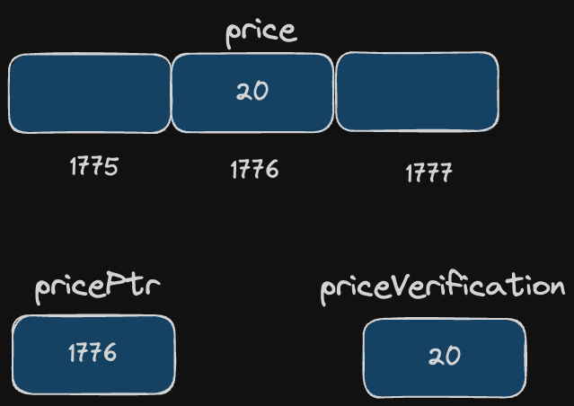

# Address-of operator (&)
**Purpose**: Returns the address of a variable.

**Syntax**:

```c++
&variable_name
```

```c++
#include <iostream>
using namespace std;

int main() {
    int price = 20;
    int *pricePtr;
    
    pricePtr = &myvar;

    cout << pricePtr;

    return 0;
}
```

