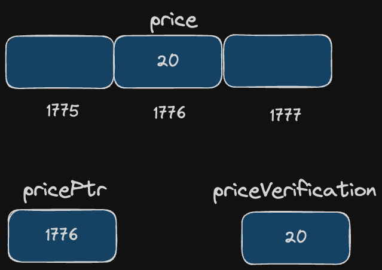

# Address-of operator (&)
**Purpose**: Returns the address of a variable.

**Read as**: address of

**Syntax**:

```c++
&variable_name
```

```c++
#include <iostream>
using namespace std;

int main() {
    int price = 20, priceVerification;
    int *pricePtr;
    
    pricePtr = &price;
    priceVerification = price;

    // Question: What value will pricePtr return?
    cout << pricePtr << endl;
    // Question: What value will priceVerification return?
    cout << priceVerification << endl;

    return 0;
}
```

